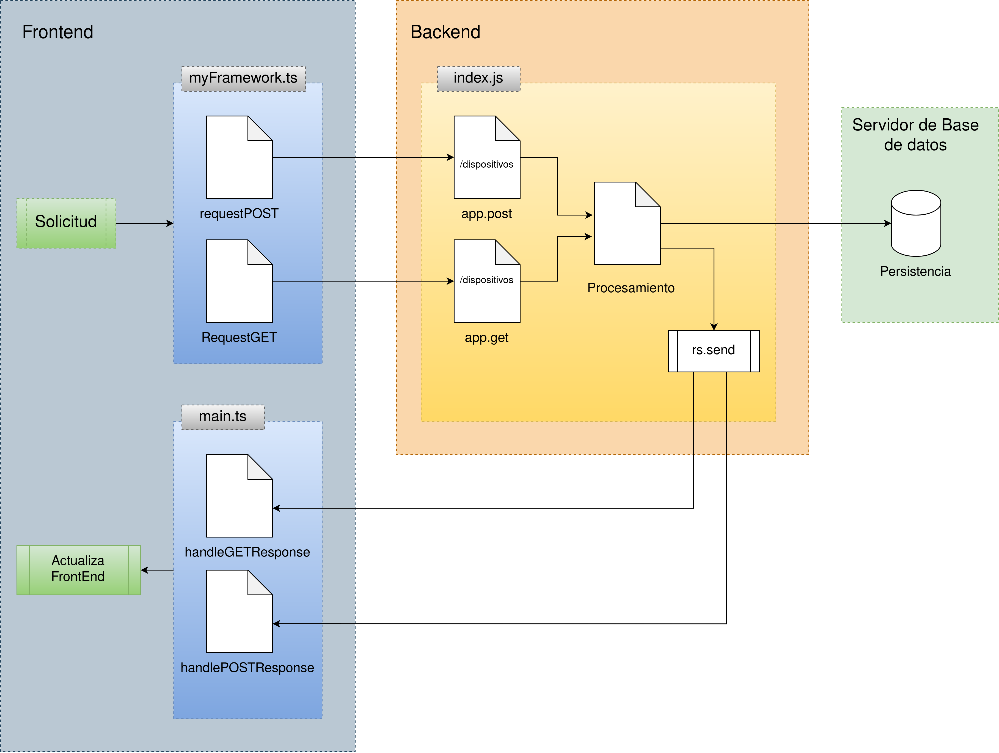
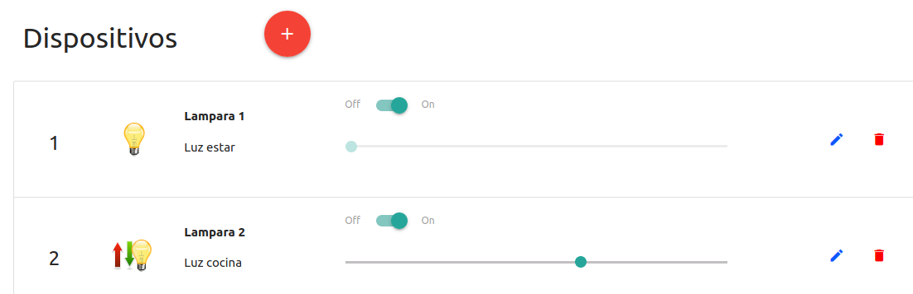
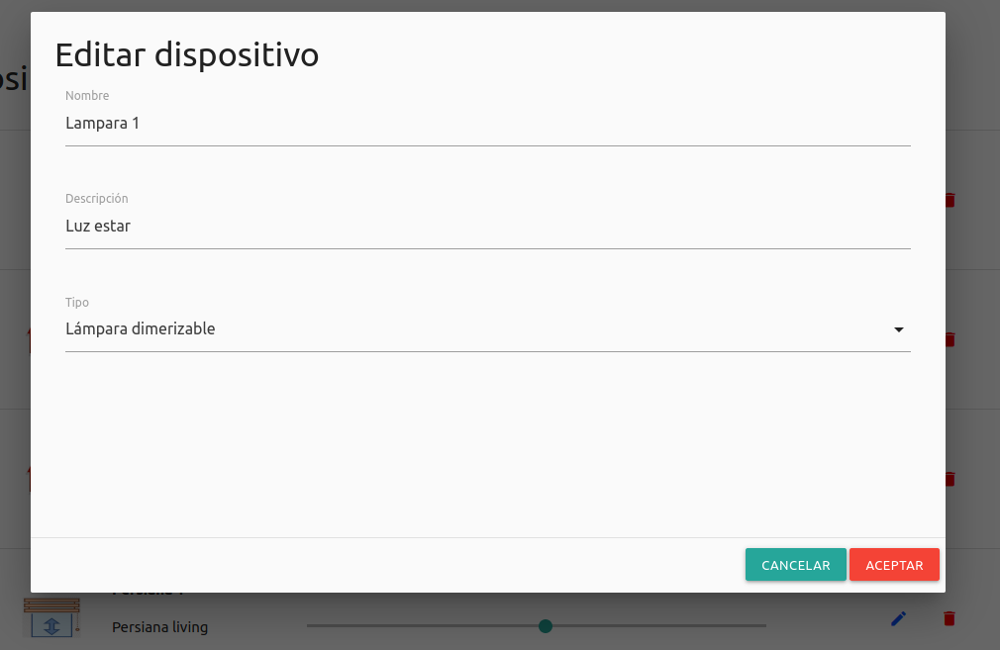
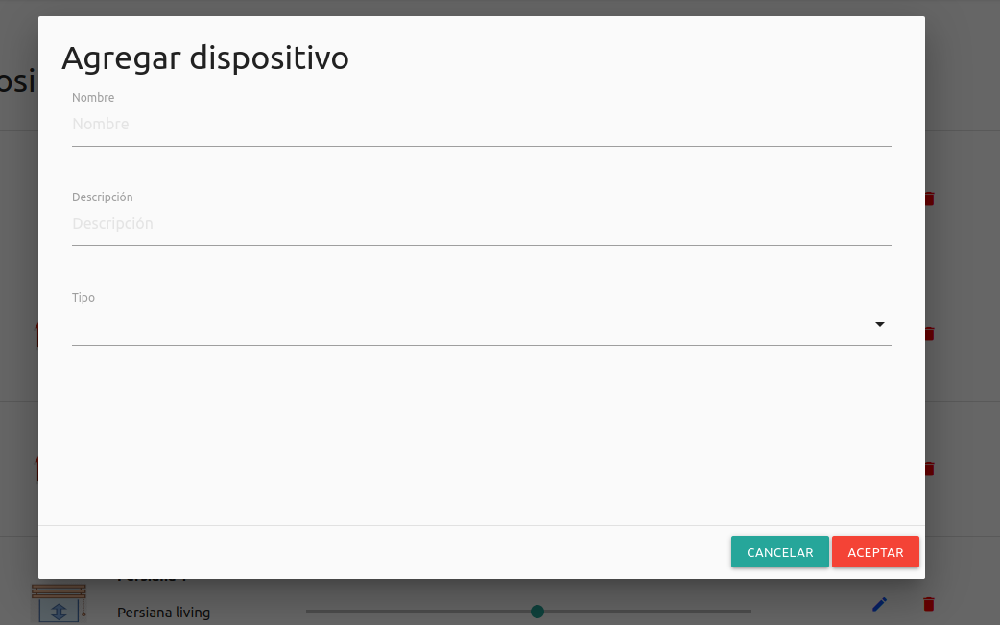
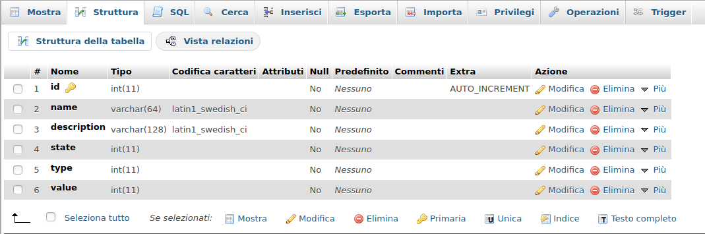
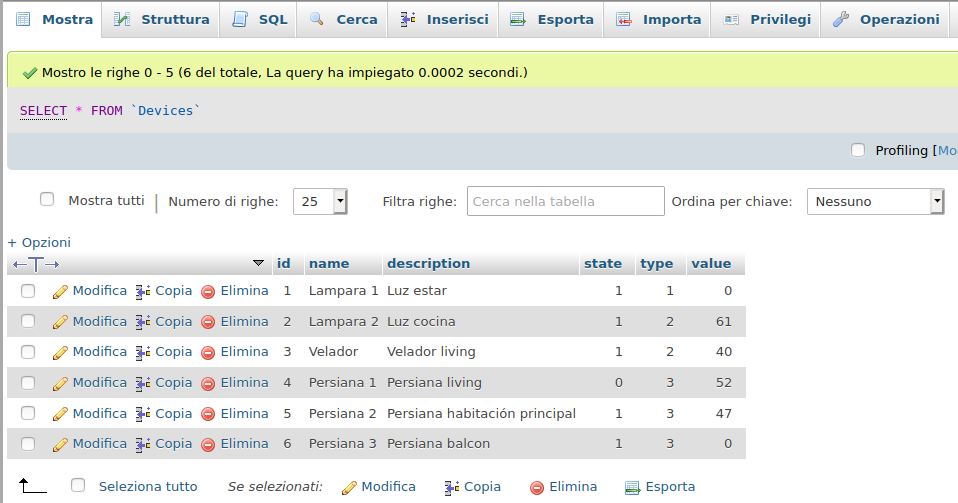

Contenidos
- [Infraestructura](#infraestructura)
- [Instalación](#instalación)
  - [Template de la aplicación](#template-de-la-aplicación)
  - [Docker](#docker)
  - [Docker-compose](#docker-compose)
  - [Imágenes](#imágenes)
  - [Comandos útiles de docker-compose](#comandos-útiles-de-docker-compose)
- [Diagrama conceptual de la aplicación](#diagrama-conceptual-de-la-aplicación)
- [Frontend](#frontend)
  - [Evento SW](#evento-sw)
  - [Evento editar](#evento-editar)
  - [Evento Add](#evento-add)
- [Backend](#backend)
  - [Métodos](#métodos)
- [Base de datos](#base-de-datos)
- [Fallas conocidas](#fallas-conocidas)
- [ToDo](#todo)
- [Licence](#licence)

# Infraestructura
La infraestructura utilizada para la construcción de esta aplicación consta de un servidor dedicado, especialmente instalado para desarrollar actividades de las materias de la Especialización en Internet de las Cosas de la Facultad de Ingeniería de la Universidad de Buenos Aires.

Datos del servidor:\
IP Local: `192.168.1.41`\
Hostname: `miot`\
SO: `Debian GNU/Linux 10`\
Acceso externo: http://mcastello.dyndns.org:8000

**Aclaraciónes importantes:**
* Como este sistema está implementado en un servidor, se dispone de una forma para que los docentes puedan ejecutarlo como fue solicitado con sólo el comando `docker-compose up`\
Para ello se definió la variable `ip_server` en el archivo `main.ts`.\
Para la ejecución en un contexto docente esta variable se establecerá con el valor `localhost`:

* Dado que se realizó una modificación en la estructura de la tabla `Devices`, se permitió guardar en el repositorio el archivo `db/data/` donde se almacenan los datos y las estrucuturas de las tablas. Para ello se descomentó la línea 92 del archivo `.gitignore`.

```js
ip_server:string = "localhost";
```
mientras que para el contextro de desarrollo su valor será:
```js
ip_server:string = "192.168.1.41";
```
Para que el docente pueda ejecutar el sistema sin cambios en el mismo, se dejará ajustada con el valor `localhost`

# Instalación 
## Template de la aplicación

Se hará un fork del repositiorio de GitHub proporcionado por los docentes:

https://github.com/ce-iot/daw-project-template.


## Docker
Se instalará docker y docker-compose, teniendo en cuenta que la distro deberá ser debian 9 o superior.

```sh
sudo apt-get update 
sudo apt-get install apt-transport-https ca-certificates curl gnupg-agent software-properties-common
```
Importar clave y verificar huella
```sh
curl -fsSL https://download.docker.com/linux/ubuntu/gpg |sudo apt-key add -
sudo apt-key fingerprint 0EBFCD88
```
Agregar repositorio de docker e instalar
```sh
sudo add-apt-repository "deb [arch=amd64] https://download.docker.com/linux/ubuntu $(lsb_release -cs) stable"
sudo apt-get update
sudo apt-get install docker-ce docker-ce-cli containerd.io
```
Configurar permisos y grupo
```sh
sudo groupadd docker
sudo usermod -aG docker $USER
sudo gpasswd -a $USER docker
```
Reiniciar servicio
```sh
sudo service docker restart
```
Verificar la instalación
```sh
sudo docker run hello-world
```
Si todo salió bien, se deberá mostrar por consola el mensaje: `Hello from docker!`

## Docker-compose

Descargar el ejecutable y dar permisos de ejecución
```sh
sudo curl -L "https://github.com/docker/compose/releases/download/1.26.2/docker-compose-$(uname -s)-$(uname -m)" -o /usr/local/bin/docker-compose
sudo chmod +x /usr/local/bin/docker-compose
``` 
Verificación
```sh
docker-compose --version
```
Deberá mostrar la versión instalada `V1.26.2`

Se deberá reiniciar el sistema para que los servicios instalados arranquen con las configuraciones correspondientes


## Imágenes
Se deberán descargar las siguientes imágenes de docker necesarias para la aplicación proporcionadas por los docentes.

```sh
docker pull harmish/typescript
docker pull mysql:5.7
docker pull phpmyadmin/phpmyadmin
docker pull abassi/nodejs-server:10.0-dev
```
Una vez descargadas, se podrá iniciar la aplicación con el comando `docker-compose up`.\
Como root:

```sh
cd /home/site/daw-project
docker-compose up
```

Esto iniciará los siguientes servicios:
>- Mysql server
>- PhpMyadmin (y dependencias)
>- NodeJs server
>- Monitor de nodejs
>- Monitor de Typescript

## Comandos útiles de docker-compose

Iniciar docker compose
```sh 
docker-compose up
```

Ver los procesos 
```sh 
docker-compose ps
```

Detener los servicios
```sh 
docker-compose stop
```

Reiniciar los servicios
```sh 
docker-compose restart
```

# Diagrama conceptual de la aplicación
En la figura se observa un diagrama representativo de la arquitectura de la aplicación. En el mismo se pueden distinguir las tres capas que la forman.
>- Frontend
>- Backend
>- Persistencia de datos

Se incluyeron en este diagrama, a modo de ejemplo, dos consultas (get y post) para visualizar el flujo de los datos dentro de la aplicación y las funciones más importantes involucradas.



# Frontend
El sistema dispone de la visualización de los dispositivos en una sección especial que incorpora la clase `collection` del framework Materialize. En tal sección, se muestran los detalles de los mismos. Esto son:

>- Número de dispositivo
>- Nombre
>- Descripción
>- Switch para encendido o apagado
>- Slider para asignar un rango de valores de 0 a 100 (sólo en caso de lámparas dimerizables o persianas)
>- Botón editar
>- Botón borrar

En la figura se muestran algunos dispositivos.


Para dar funcionalidad a los botones, se programaron para cada dispositivo los eventos listener utilizando la función `configEventLister`, que se ejecuta cuando se carga la colección de dispositivos.

```js
        //--Arma las escuchas de los clicks
        for(let d of data){
            //--Escucha switch on/off
            this.myf.configEventLister ("click", `sw_${d.id}`, this);
            //--Escucha boton edición dispositivo
            this.myf.configEventLister ("click", `edit_${d.id}`, this);
            //--Escucha boton borrar dispositivo
            this.myf.configEventLister ("click", `del_${d.id}`, this);
            //--Escucha slider dispositivo
            this.myf.configEventLister ("change", `rang_${d.id}`, this);
            //--Escucha apertura de modal
            this.myf.configEventLister ("click", "modal1", this);
        }
```

Los siguientes fragmentos de código forman parte de la función principal `handleEvent` que atiende los eventos solicitados por el usuario, para ello, se implementa un `switch` con un `case` para cada evento. Se describirán a continuación cada uno de ellos:

## Evento SW
Cuando se presiona el botón para cambiar el estado de un dispositivo (on/off), el sistema escucha este evento y graba este nuevo estado en la base de datos. El código es el siguiente:

```js
case "sw":
  //--Cambia estado del Switch del dispositivo
  let state:boolean = this.view.getSwitchStateById(elemento.id);
  let data_sw = {"id":`${elemento.id}`,"state":state};
  this.myf.requestPOST(`http://${this.ip_server}:8000/sw-dispositivos`,data_sw,this);            
  break;
```
## Evento editar

Cuando se presiona el botón `editar` de un determinado dispositivo, se despliega un formulario modal que muestra los valores para ese dispositivo. Los valores editables son:
>- Nombre
>- Descripción
>- Tipo

El código siguiente carga en el modal los valores del dispositivo a editar

```js
  case "edit":
    //--Título del modal
    this.myf.getElementById('tit_modal').innerHTML='Editar dispositivo';
    //--Trae los valores del dispositivo al modal
    (<HTMLInputElement>this.myf.getElementById('nombre_dis')).value=<string>this.myf.getElementById(`name_${elemento.id.split('_')[1]}`).textContent;
    (<HTMLInputElement>this.myf.getElementById('descrip_dis')).value=<string>this.myf.getElementById(`desc_${elemento.id.split('_')[1]}`).textContent;              
    //--Guarda la id del dispositivo en el modal 
    (<HTMLInputElement>this.myf.getElementById('id_dis')).value=elemento.id;
    break;
```

Luego, al presiona el botón `Aceptar`, el sistema sale del formulario modal y debe determinar si se editó o agregó un dispositivo, luego guarda estos valores en base de datos.\
Se muestra el código que se encarga de esta función.

```js
  case "modalacep":
    //--Sale del Modal con boton Aceptar asignando los valores de los campos
    let nombre:string = (<HTMLInputElement>this.myf.getElementById('nombre_dis')).value;
    let descripcion:string = (<HTMLInputElement>this.myf.getElementById('descrip_dis')).value;
    let tipo:string = (<HTMLInputElement>this.myf.getElementById('tipo_dis')).value;
    let id_mod:string=(<HTMLInputElement>this.myf.getElementById('id_dis')).value;
    //-- Ver si sale de inserción o de adición de dispositivo
    let context_modal:string = (<HTMLBodyElement>this.myf.getElementById('tit_modal')).innerHTML;
    if(context_modal=="Editar dispositivo"){
      //--edita
      console.log("id:"+id_mod);
      data = {"id":`${id_mod}`,"action":"edit","name":`${nombre}`,"description":`${descripcion}`,"state":"0","type":`${tipo}`,"value":0};  
    }else{
      //--agrega
      data = {"id":"","action":"add","name":`${nombre}`,"description":`${descripcion}`,"state":"0","type":`${tipo}`,"value":0};             
    }
    //--Graba nuevo dispositivo en BD
    this.myf.requestPOST(`http://${this.ip_server}:8000/add-dispositivos`,data,this);
    break;
```
La figura muestra el modal para edición desplegado.


## Evento Add
Un botón con un signo + se muestra al inicio de la página. Al presionar este, despliega nuevamente el formulario modal, pero con el título correspondiente a la adición de un dispositivo. Se limpian todos los campos editables de este formulario.\
Al presionar el botón `Aceptar` el sistema procederá de la misma forma que en el evento `editar`.

La figura muestra el modal para agregar dispositivos desplegado.


# Backend
Implementado en el archivo `index.js`.\
Se verán los métodos encargados de guardar los datos provenientes del frontend. Dado que la implementación de los métodos es bastante semejante entre sí, sólo se mostrarán los argumentos de los mismos.

Para los métodos POST, se recojen del objeto `req.body`, las variables necesarias para hacer la consulta a la base de datos.\
Es importante aclarar que para dar seguridad al sistema, se implementa la siguiente forma de enviar las variables cuando se hace la consulta (ejemplo para grabar el valor del slider de un dispositivo):

```js
connectionMySQL.query('update Devices set value=? where id=?',[value,id],function(err,respuesta)
```
Donde se observa que las variables son enviadas como parámetros separados y no envueltas en la string propia de la consulta.

## Métodos

Busca dispositivos en la base de datos
```js
app.get('/ver-dispositivos', function(req, res, next){}
``` 

Graba el cambio del switch en base de datos

```js
app.post ('/sw-dispositivos', function(req,res){}
```

Graba el cambio del slider en base de datos

```js
app.post ('/update-range', function(req,res){}
```
Borra un dispositivo de la base de datos

```js
app.post ('/del-dispositivos', function(req,res){}
```

Agrega un dispositivo a la base de datos

```js
app.post ('/add-dispositivos', function(req,res){}
```

# Base de datos
Está implementada con el motor MySQL y consta de una tabla llamada `Devices` con la siguiente estructura.



El campo `id` está definido como clave primaria.\
Los campos `name` y `description` son del tipo `varchar`.\
Los campos `state`, `type` y `value` son del tipo entero.\
Se agregó el campo `value` a la tabla. Este campo maneja la potencia o la posición de los dispositivos tipo 2 y 3, lámpara dimerizable y persiana, respectivamente.\
Se eligió para el campo value un entero, ya que se piensa que la variación de la potencia de la lámpara o la posición de la persiana variarán entre el 0 y el 100%.

Se muestran a continuación algunos datos guardados en la tabla



# Fallas conocidas
>- Cuando se despliega el formulario modal, el elemento `select` no toma el valor que tienen en el dspositivo. Tampoco se ubica en el valor `0` (Seleccionar) cuando se despliega al agregar un dispositivo.
>- Cuando se produce un cambio de estado ya sea en el switch o en el slider, no se refresca la página, por consiguiente no muestra en tiempo real el cambio de imágen de la lápara encendida o apagada.
>- Pasado un tiempo no determinado aún, la aplicación deja de estar disponible. Si se verifica el estado de los servicios con `docker-compose ps`, los mismos se muestran como `Up`. Es necesario reiniciar docker-compose para que la aplicación vuelva a estar disponible.

# ToDo
La siguiente es una lista de las actividades por realizar.

>- Instalar nginx y configurarlo para que el acceso al sitio sea a través de protocolo de seguridad (TLS).
>- Incorporar al sitio un login con usuario y contraseña, para dar seguridad y tener la posibilidad de asignar roles de usuario.
>- Optimizar las funciones app.post y app.get del backend enviando un accion determinada a realizar manteniendo la misma ruta.
>- Implementar en el backend los métodos correspondientes (GET, POST, PUT, DELETE) para los eventos según las convenciones REST.
>- Optimizar en la función `handleEvent` de `main.ts` el uso de las variables que llevan los datos al backend para grabar en la base de datos. Se usan las variables data, data_sw,data_rg, data_del. Usar sólo la variable `data` que está definida con el tipo `DeviceInt`.

# Licence

This project is published under GPLV3+ licence.


